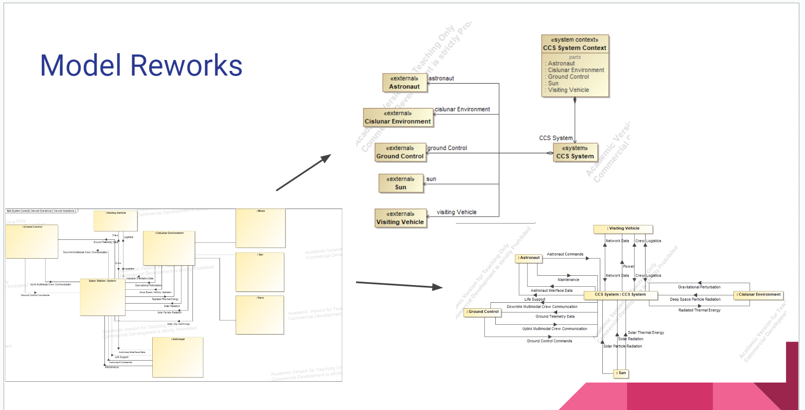

# Clay's Engineering Notebook
This serves as a personal documentation of the things that happened during the course of the semester. Semester two is listed above semester one for ease of reading.
_____________________________________________________________________________________________________________
## Semester Two

### Sprint One
Coming into the new semester, our focus was on recreating some of the previous models with new influence from our customer and researching the FMEA plugin for our system. We also needed to discuss with our customer the expect deliverable at the end of the semester. 

**01/12/2023**

* We had our first meeting of the semester with customer
* Customer advised us that our models needed some rework
* Started the discussion about FMEA

**01/15/2024**

* Started to work with Luke on remodeling models
* Distributed the workload between team members

**01/30/2024**

* Most models are in a good state with a few in exception
* Still not to sure on the proper modeling for Concecptual Subsystem
* Teammember helped me with the installation of FMEA plugin for next Sprint

**02/03/2024**

* New meeting with customer scheduled
* All models finished 

#### My tasks
My main focus was working with Luke on redoing the models. We used previous feedback and made needed changes to prepare our final problem domain for analysis. 

#### Blockers
Our main blocker this sprint was dealing with new, changing schedules and trying to reevaluate on what our team's priorities should be. There were a couple of directions that we have to evaluate and decide between for the rest of our work.

Photo of old / new diagrams:

#### Reflection
This semester was very different in schedule from last semester, we still got to meet with our customer multiple times and were able to get a very strong start on this semester. I think we will be able to easily accompish the overall goals we set for this semester. Next sprint, we will begin implementing the FMEA analysis plugin and will hopefully be able to generate an accurate fault tree for our model!

Number of client meetings: ~3
Number of team meetings: ~8
Next Priority: Learn FMEA tool

### Sprint Two
This sprint, we worked mainly on generating fault items as well as finishing up the final diagrams we needed.

**02/14/2024**
* We met with the client and evaluated feedback on our models
* Worked to redefine stakeholder needs

**02/15/2024**
* Client meeting to go over FMEA plugin tool

**02/20/2024**
* Team meeting to cover progress and work on initial FMEA items

**02/24/2024**
* Team meeting for making a presentation for sprint two
* Worked on documentation overhaul based on TA feedback

**03/04/2024**
* Meeting with client to go over presentation guidlines
* Test presentation

**03/05/2024**
* Delivered sprint 2 presentation to class and professor.
* Overall, we rececived pretty positive feedback, and have a good idea on how our final presentation will look.

**03/09/2024 - 03/16/2024**
* ERAU spring break, decent work completed individually, but no team meeting

#### Reflection / Blockers
Overall our work is going fairly well. My tasks have been mainly on adding the safety requirements based on our generated FMEA items. We did not meet as often with our client during this sprint which slowed us down a bit on getting feedback, but overall we were able to move items arround to accomidate for times when our client was unavaiable.

### Sprint Three
This is the last working semester of the project, our main goal is to finish our FMEA items and overhaul our documentation a final time. Based on client feedback we will be able to reach our goal by the end of the semester.

**3/17/2024**
* Team progess meeting, discussed sprint 3 goals.

**3/20/2024**
* Client recap meeting
* Final feedback for models received
* More work on FMEA items needed

**3/28/2024**
* Meeting with client
* All models finished
* FMEA items look good
* Putting together final analysis on model
* Discussed final presentation and documentation deliverable plans
* Possible plans to present MBSE to client's classroom

**3/30/2024**
* Virtual team progress meeting
* * we were asked by the client to prepare a presentation to show in a classroom setting

**4/10/2024**
* Delivered virtual presentation to client's classroom enviroment

**4/15/2024**
* Team meeting to adapt previous presentation to our final sprint presentation

**4/18/2024**
* Delievered final sprint presentation within our classroom

**4/25/2024**
* Final team meeting to wrap up loose changes
* Delivered final model to client and completed project retrospective to review our work over the past year

## Final Project Reflection
For this project, we were tasked with using MagicDraw within the context of a cislunar space station to determine the usability and feasability of Model Based Systems Engineering, with a focus on the avionics subsystem of the spacecraft. From this, we created multiple views of our model as we learned more about the problem domain. We generated requirements based on NASA's gateway system and analyzed the model in the context of redundant safety on the system of interest. Overall, we found the project to be a success. We were able to create and explore different parts of our model in parallel and created traces between all parts of our model. When requirements were modified, the changes propigated throughout the whole model automatically. Our team strongly reccomends MagicDraw as the solution to keeping up with constant changes in requirements and documentation within a system of interest, fit for small hobby teams or department wide organizations.
_____________________________________________________________________________________________________________

## Semester One
### Sprint One
#### Introduction
For sprint one: we met with clients, decided on a tool, formed our team, created documentation, performed a literature review, and began to look into our tool of choice, MagicDraw.
#### My Tasks
In this sprint, I worked on the initial documentation and worked on the literature review (MBSE Section) (Link to confluence). 
#### Blockers
We had a few issues with getting our licenses for the tool, which delayed our starting time by arounds a week or two. Despite this, we still held meetings and were able to plan ahead a bit.
We also had issues when trying to scope our problem and decide exactly what our domain should be. We switched clients part way through, which also caused some setbacks.

### Sprint Two
#### Introduction
In this sprint, we began to get more deeply into the MagicGrid Framework, and began work on our models.
#### Backlog

#### Description
Originally, we planned for me and Walter to work on the conceptual subsystem 
within the system structure column. We worked on this for a while but found
it difficult to vizualize what components may be included in a "generic system",
as many systems could be considered too general (not useful) or as part of the 
implementation (too specific). 

Following this, we discussed our blocker with the stakeholder and decided
to pivot a bit in our approach. We decided, instead of assuming and entirely
generic model, to generate our own 'likely' stakeholder needs largly based on 
NASA's Gateway Spacecraft. This helped us not have to worry about what is/isn't
'generic enough' for the system. 

We generated the following requirements using this approach (first draft):

We then used these to think to refine the external systems:

Next, we created a sample use case for our stakeholder to review:

Lastly, we started working on (but did not yet complete) the Measures of Effectiveness.

#### Reflection
In this sprint, my task was mainly to work on the use case and scenario. However,
a majority of our work was done using a whiteboard/open room approach. We held 
frequent meetings (2-3 times per week outside of class) and utilized round
table discussion in both making models and working on the documentation. I believe 
it was a slower, but much better approach to finishing our work.

#### Next Sprint
In sprint 3, we hope to finish the problem domain and will be able to present
a finished model and describe the complex interlinking between them.

### Sprint Three
In this sprint, I worked mainly on the functional analysis model as well as generating
requirements for version 3 of the SRS. As a team, we decided that some of our previous
models needed further iteration.

We were able to remake a few of ours and also began work on the new ones. I think that we will
reach our final goal of delivering the project domain of the CCS by the end of the semester.

#### End of semester
During this sprint we had a lot of blockers but we were able to finish everything on time. My main tasks this sprint were wokring on the new scenario, functional analysis, and generating requirements of our team as a customer of MagicDraw and MBSE.

## Semester Reflection
Overall, this project served as a great learning expirence for me. Before this class I only learned UML-style modeling, and only as a precursor to implementing a solution. In this class, I worked exclusively on the design portion of the ccs system, and needed to fully flesh out our model without wriitng any code. I think this project allowed me to learn more about the SYSE process but also made me better at SE, specifically when it comes to eliciting requirements and validating our models.
