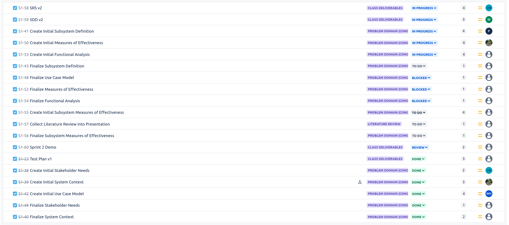
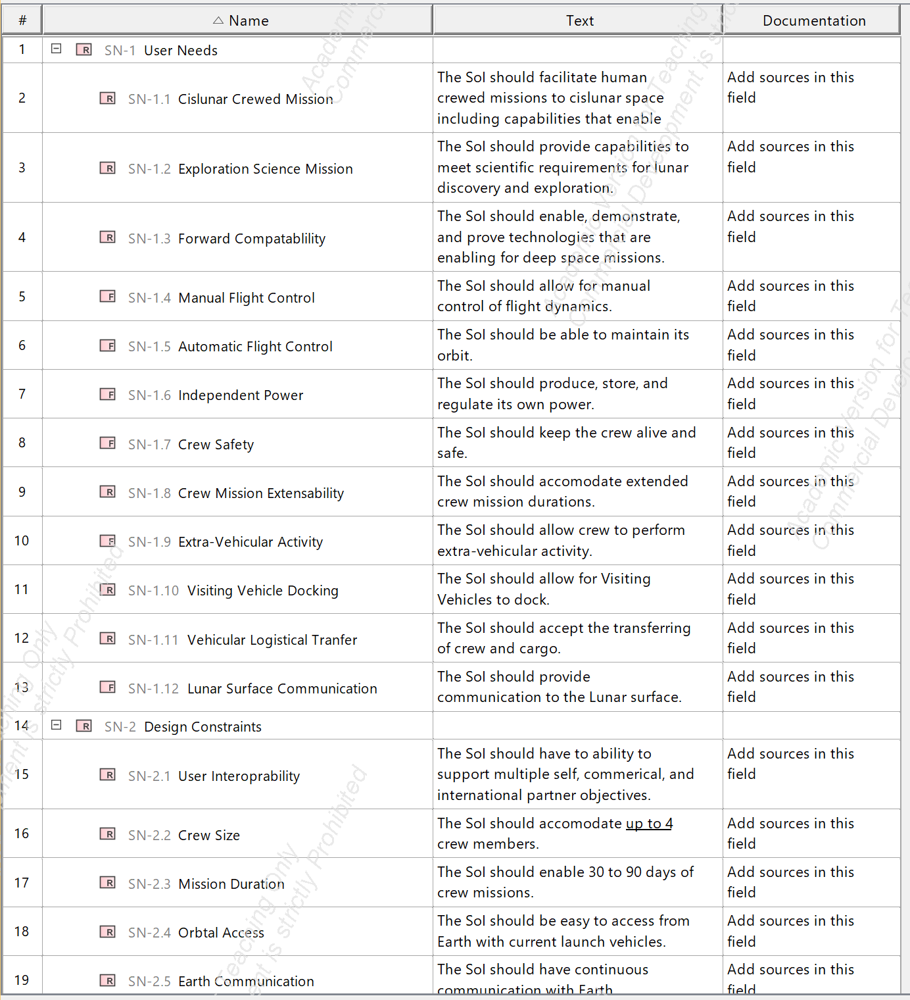
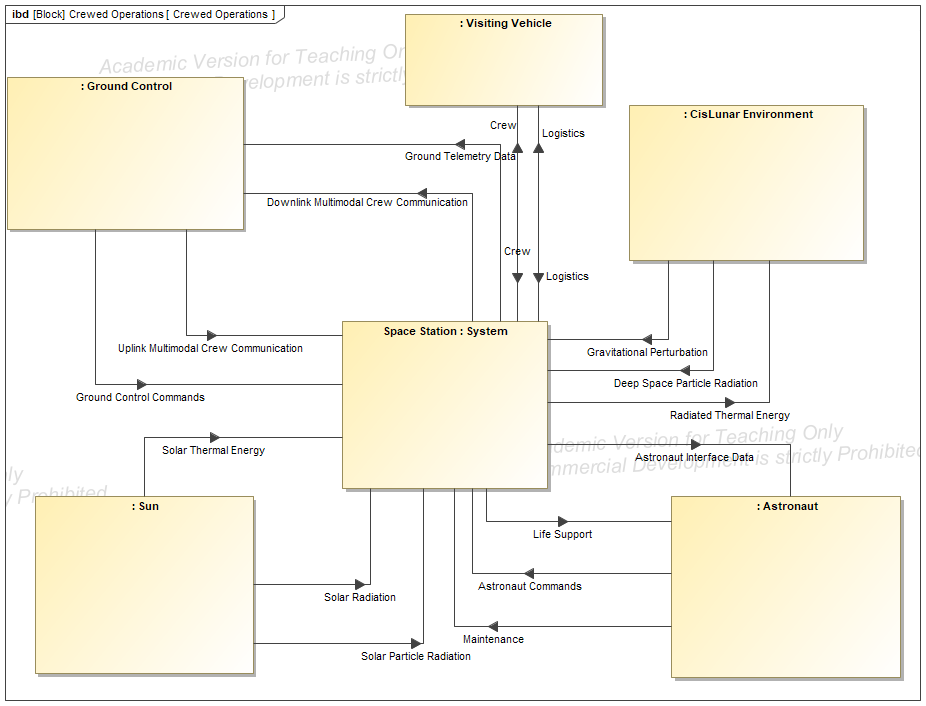
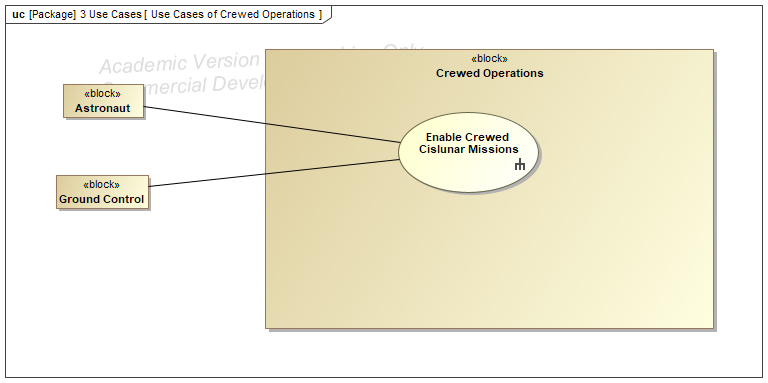
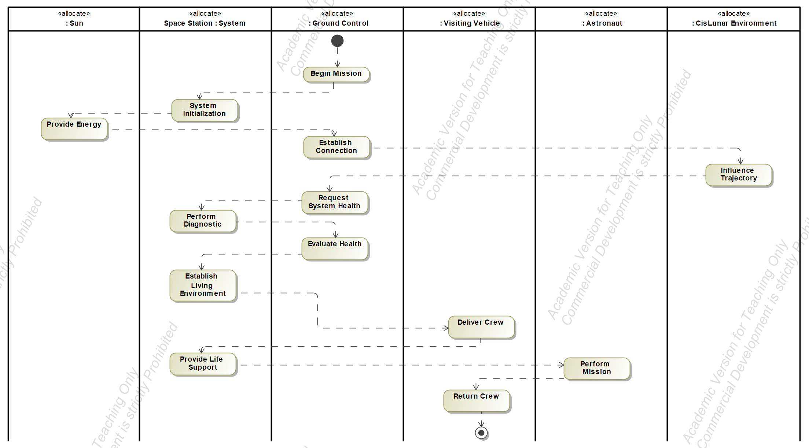

# Clay's Engineering Notebook
This serves as a personal documentation of the things that happened during the course of the semester.

## Semester Two

### Sprint One
Coming into the new semester, our focus was on recreating some of the previous models with new influence from our customer and researching the FMEA plugin for our system.

#### My tasks
My main focus was working with Luke on redoing the models. We used previous feedback and made needed changes to prepare our final problem domain for analysis

#### Blockers
Our main blocker this sprint was dealing with new, changing schedules and trying to reevaluate on what our team's priorities should be. There were a couple of directions that we have to evaluate and decide between for the rest of our work.

Photo of old / new diagrams:

## Semester One
### Sprint One
#### Introduction
For sprint one: we met with clients, decided on a tool, formed our team, created documentation, performed a literature review, and began to look into our tool of choice, MagicDraw.
#### My Tasks
In this sprint, I worked on the initial documentation and worked on the literature review (MBSE Section) (Link to confluence). 
#### Blockers
We had a few issues with getting our licenses for the tool, which delayed our starting time by arounds a week or two. Despite this, we still held meetings and were able to plan ahead a bit.
We also had issues when trying to scope our problem and decide exactly what our domain should be. We switched clients part way through, which also caused some setbacks.

### Sprint Two
#### Introduction
In this sprint, we began to get more deeply into the MagicGrid Framework, and began work on our models.
#### Backlog

#### Description
Originally, we planned for me and Walter to work on the conceptual subsystem 
within the system structure column. We worked on this for a while but found
it difficult to vizualize what components may be included in a "generic system",
as many systems could be considered too general (not useful) or as part of the 
implementation (too specific). 

Following this, we discussed our blocker with the stakeholder and decided
to pivot a bit in our approach. We decided, instead of assuming and entirely
generic model, to generate our own 'likely' stakeholder needs largly based on 
NASA's Gateway Spacecraft. This helped us not have to worry about what is/isn't
'generic enough' for the system. 

We generated the following requirements using this approach (first draft):

We then used these to think to refine the external systems:

Next, we created a sample use case for our stakeholder to review:

Lastly, we started working on (but did not yet complete) the Measures of Effectiveness.

#### Reflection
In this sprint, my task was mainly to work on the use case and scenario. However,
a majority of our work was done using a whiteboard/open room approach. We held 
frequent meetings (2-3 times per week outside of class) and utilized round
table discussion in both making models and working on the documentation. I believe 
it was a slower, but much better approach to finishing our work.

#### Next Sprint
In sprint 3, we hope to finish the problem domain and will be able to present
a finished model and describe the complex interlinking between them.

### Sprint Three
In this sprint, I worked mainly on the functional analysis model as well as generating
requirements for version 3 of the SRS. As a team, we decided that some of our previous
models needed further iteration.

We were able to remake a few of ours and also began work on the new ones. I think that we will
reach our final goal of delivering the project domain of the CCS by the end of the semester.

#### End of semester
During this sprint we had a lot of blockers but we were able to finish everything on time. My main tasks this sprint were wokring on the new scenario, functional analysis, and generating requirements of our team as a customer of MagicDraw and MBSE.

## Final Reflection
Overall, this project served as a great learning expirence for me. Before this class I only learned UML-style modeling, and only as a precursor to implementing a solution. In this class, I worked exclusively on the design portion of the ccs system, and needed to fully flesh out our model without wriitng any code. I think this project allowed me to learn more about the SYSE process but also made me better at SE, specifically when it comes to eliciting requirements and validating our models.
